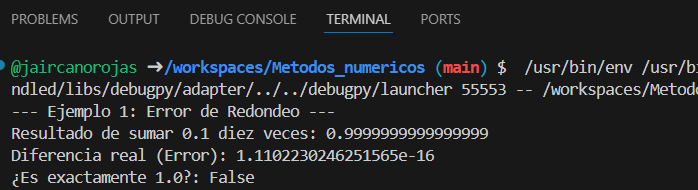
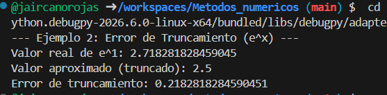
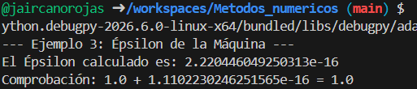
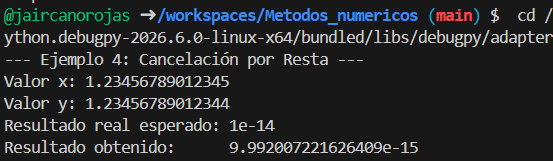
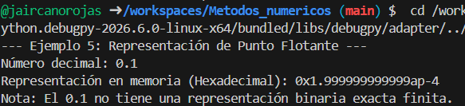

# Tema 1: Teoría de Errores

## Concepto

En métodos numéricos, los errores son la diferencia entre el valor real de una magnitud y el valor calculado mediante un algoritmo. Las computadoras tienen una precisión finita, lo que genera pequeñas desviaciones que pueden acumularse.

Existen tres tipos principales de errores:

1. **Error Absoluto:** Es la diferencia física entre el valor real y el aproximado.
2. **Error Relativo:** Es el error absoluto dividido entre el valor real (da una idea de la importancia del error).
3. **Error porcentual:** Es el error relativo multiplicado por 100.

## Fórmulas:

* **Error absoluto:** $$e_a = |V_{real} - V_{aprox}|$$
* **Error Relativo:** $$e_r = \frac{e_a}{|V_{real}|}$$
* **Porcentaje de error:** $$e_p = e_r \times 100$$

---

## Implementación y Ejemplos

### Ejemplo de Referencia
* [Cálculo de Errores Base](./ejercicios_tema1.py)

### Ejemplos Prácticos
A continuación se presentan los ejercicios desarrollados para este tema:

* [Ejemplo 1: Error de Redondeo](./1_Error_Redondeo.py)
* [Ejemplo 2: Error de Truncamiento](./2_Error_Truncamiento.py)
* [Ejemplo 3: Precisión de Máquina](./3_Precision_Maquina.py)
* [Ejemplo 4: Error en Operaciones Aritméticas](./4_Error_Aritmetico.py)
* [Ejemplo 5: Conversión de decimal a binario](./5_Decimal_Binario.py)

---

## 📊 Galería de Resultados Visuales

En esta sección se presentan las capturas de pantalla de la ejecución de cada algoritmo, permitiendo verificar la precisión y el comportamiento de los errores calculados.

| Ejercicio | Captura del Resultado |
| :--- | :--- |
| **1. Error de Redondeo** |  |
| **2. Error de Truncamiento** |  |
| **3. Precisión de Máquina** |  |
| **4. Operaciones Aritméticas** |  |
| **5. Conversión Binaria** |  |

> **Nota:** Para replicar estos resultados, ejecute los archivos `.py` correspondientes en su terminal local.