# Tema 2: Solución de Ecuaciones de una Variable

En este tema se exploran los algoritmos utilizados para hallar las raíces de funciones no lineales. A continuación, se detalla la lógica y el desarrollo de cada método.

---

## 1. Método de Bisección

### Concepto
Es un algoritmo de búsqueda de raíces que divide repetidamente un intervalo a la mitad y selecciona el subintervalo donde se encuentra la raíz. Se basa en el Teorema del Valor Intermedio.

### Algoritmo
1. **Entrada:** Función $f(x)$, intervalo $[a, b]$ tal que $f(a) \cdot f(b) < 0$.
2. **Cálculo:** Se obtiene el punto medio: 
   $$x_r = \frac{a + b}{2}$$
3. **Validación:** Si $f(a) \cdot f(x_r) < 0$, la raíz está en el lado izquierdo ($b = x_r$). De lo contrario, está en el derecho ($a = x_r$).
4. **Repetición:** Se itera hasta que el error sea menor a la tolerancia.

  

### Implementación
* [Código Base: Bisección](./1_Biseccion.py)

### Ejercicios
* [Ejercicio 1: Polinomio cuadrático](./1_Biseccion1.py)
* [Ejercicio 2: Función cúbica](./1_Biseccion2.py)
* [Ejercicio 3: Función trascendental](./1_Biseccion3.py)
* [Ejercicio 4: Función exponencial](./1_Biseccion4.py)
* [Ejercicio 5: Función logarítmica](./1_Biseccion5.py)
---
## 📊 Galería de Resultados Visuales

En esta sección se presentan las capturas de pantalla de la ejecución de cada algoritmo, permitiendo verificar la convergencia de los métodos y el cálculo de raíces.

| Ejercicio | Captura del Resultado |
| :--- | :--- |
| **1. Polinomio Cuadrático (Bisección)** | 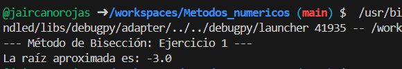 |
| **2. Función Cúbica (Bisección)** | 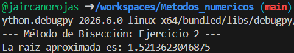 |
| **3. Función Trascendental (Bisección)** | 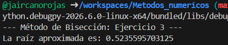 |
| **4. Función Exponencial (Bisección)** | 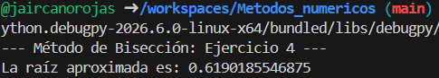 |
| **5. Función Logarítmica (Bisección)** | 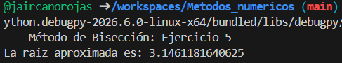 |

> **Nota:** Para replicar estos resultados, ejecute los archivos `.py` correspondientes en su terminal local.

## 2. Método de Regla Falsa

### Concepto
A diferencia de la bisección, este método conecta los puntos $f(a)$ y $f(b)$ con una línea recta para estimar la raíz en la intersección con el eje $x$, lo que suele acelerar la convergencia.

### Algoritmo
1. **Entrada:** Intervalo $[a, b]$ con cambio de signo.
2. **Fórmula:** Se calcula la aproximación mediante:
   $$x_r = b - \frac{f(b)(a - b)}{f(a) - f(b)}$$
3. **Criterio:** Se evalúa el signo para actualizar los límites del intervalo.

  

### Implementación
* [Código Base: Regla Falsa](./2_Regla_Falsa.py)

### Ejercicios
* [Ejercicio 1: Raíz de x^2 - 2](./2_Regla_Falsa1.py)
* [Ejercicio 2: Polinomio de grado 3](./2_Regla_Falsa2.py)
* [Ejercicio 3: Función trigonométrica](./2_Regla_Falsa3.py)
* [Ejercicio 4: Función combinada](./2_Regla_Falsa4.py)
* [Ejercicio 5: Error porcentual en Regla Falsa](./2_Regla_Falsa5.py)

---

## 📊 Galería de Resultados Visuales: Regla Falsa

En esta sección se presentan las capturas de pantalla de la ejecución de los algoritmos de Regla Falsa, mostrando cómo la interpolación lineal acelera la búsqueda de la raíz.

| Ejercicio | Captura del Resultado |
| :--- | :--- |
| **1. Raíz de x^2 - 2** | 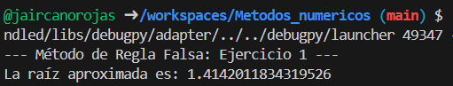 |
| **2. Polinomio de grado 3** | 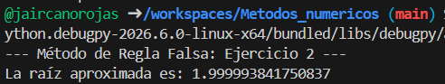 |
| **3. Función trigonométrica** | 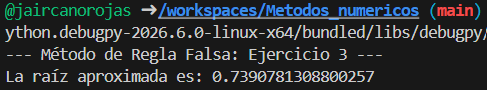 |
| **4. Función combinada** | 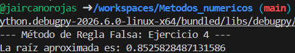 |
| **5. Error porcentual en Regla Falsa** | 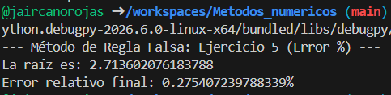 |

> **Nota:** Para replicar estos resultados, ejecute los archivos `.py` correspondientes en su terminal local.

## 3. Punto Fijo

### Concepto
Transforma $f(x) = 0$ en $x = g(x)$. Se busca el punto donde la curva cruza la línea de 45 grados ($y = x$).

### Algoritmo
1. **Preparación:** Despejar $x$ de la ecuación original.
2. **Iteración:** Usar la fórmula recursiva:
   $$x_{i+1} = g(x_i)$$
3. **Convergencia:** El proceso se detiene cuando $|x_{i+1} - x_i| < tol$.

  

### Implementación
* [Código Base: Punto Fijo](./3_Punto_Fijo.py)

### Ejercicios
* [Ejercicio 1: g(x) de una raíz cuadrada](./3_Punto_Fijo1.py)
* [Ejercicio 2: g(x) de un coseno](./3_Punto_Fijo2.py)
* [Ejercicio 3: Análisis de convergencia](./3_Punto_Fijo3.py)
* [Ejercicio 4: g(x) exponencial](./3_Punto_Fijo4.py)
* [Ejercicio 5: g(x) fraccionaria](./3_Punto_Fijo5.py)

---

## 📊 Galería de Resultados Visuales: Punto Fijo

En esta sección se presentan las capturas de pantalla de la ejecución del método de Punto Fijo, donde se observa cómo la sucesión de valores $x_{i+1} = g(x_i)$ converge a la intersección con la recta $y = x$.

| Ejercicio | Captura del Resultado |
| :--- | :--- |
| **1. g(x) de una raíz cuadrada** | 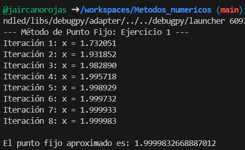 |
| **2. g(x) de un coseno** | 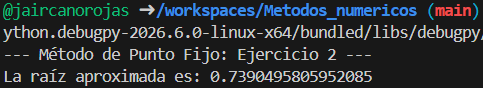 |
| **3. Análisis de convergencia** | 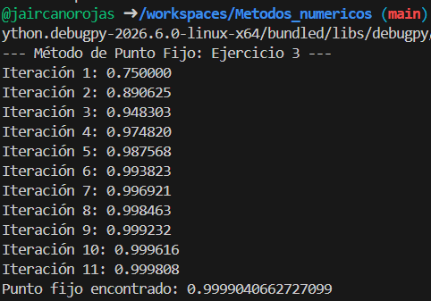 |
| **4. g(x) exponencial** | 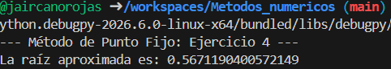 |
| **5. g(x) fraccionaria** | 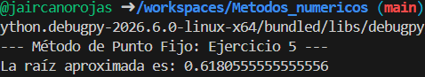 |

> **Nota:** Para replicar estos resultados, ejecute los archivos `.py` correspondientes en su terminal local.

## 4. Newton-Raphson

### Concepto
Utiliza la pendiente (tangente) de la función en un punto para proyectar la ubicación de la raíz. Es el método más rápido si el valor inicial es cercano a la raíz.

### Algoritmo
1. **Entrada:** Valor inicial $x_i$ y la derivada $f'(x)$.
2. **Fórmula:** $$x_{i+1} = x_i - \frac{f(x_i)}{f'(x_i)}$$
3. **Parada:** Detener cuando el error absoluto sea mínimo.

  

### Implementación
* [Código Base: Newton-Raphson](./4_Newton_Raphson.py)

### Ejercicios
* [Ejercicio 1: Newton en polinomios](./4_Newton_Raphson1.py)
* [Ejercicio 2: Newton en raíces de grado n](./4_Newton_Raphson2.py)
* [Ejercicio 3: Convergencia rápida](./4_Newton_Raphson3.py)
* [Ejercicio 4: Newton con trigonométricas](./4_Newton_Raphson4.py)
* [Ejercicio 5: Newton con exponenciales](./4_Newton_Raphson5.py)

---

## 📊 Galería de Resultados Visuales: Newton-Raphson

En esta sección se presentan las capturas de pantalla del método de Newton-Raphson, destacando su convergencia cuadrática y el uso de las rectas tangentes para localizar la raíz.

| Ejercicio | Captura del Resultado |
| :--- | :--- |
| **1. Newton en polinomios** | 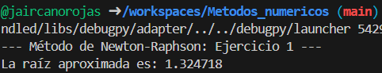 |
| **2. Newton en raíces de grado n** | 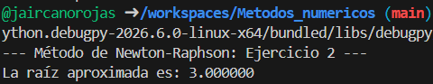 |
| **3. Convergencia rápida** | 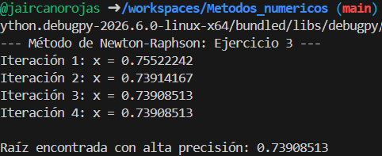 |
| **4. Newton con trigonométricas** | 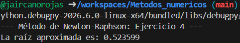 |
| **5. Newton con exponenciales** | 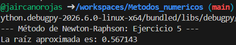 |

> **Nota:** Para replicar estos resultados, ejecute los archivos `.py` correspondientes en su terminal local.

## 5. Método de la Secante

### Concepto
Es una variación de Newton-Raphson que no requiere calcular la derivada. En su lugar, usa dos puntos para trazar una línea secante.

### Algoritmo
1. **Entrada:** Dos puntos iniciales $x_0$ y $x_1$.
2. **Fórmula:**
   $$x_{i+1} = x_1 - \frac{f(x_1)(x_0 - x_1)}{f(x_0) - f(x_1)}$$
3. **Iteración:** Se actualizan los puntos para la siguiente secante.

  

### Implementación
* [Código Base: Secante](./5_Secante.py)

### Ejercicios
* [Ejercicio 1: Secante para x^2 - 4](./5_Secante1.py)
* [Ejercicio 2: Secante en logaritmos](./5_Secante2.py)
* [Ejercicio 3: Comparación con Newton](./5_Secante3.py)
* [Ejercicio 4: Secante en funciones potentes](./5_Secante4.py)
* [Ejercicio 5: Aproximación de raíz cúbica](./5_Secante5.py)

