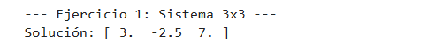
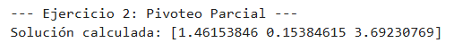
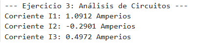
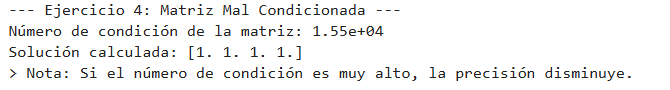
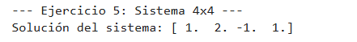
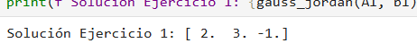
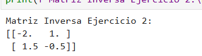
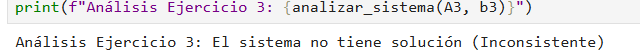
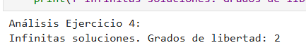
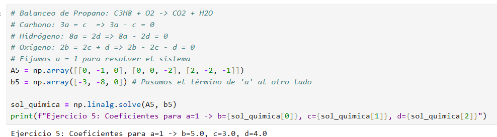

# Tema 3: Sistemas de Ecuaciones Lineales

En este tema se estudian los métodos para resolver sistemas de ecuaciones lineales de la forma $Ax = b$. Se exploran tanto métodos directos, que buscan una solución exacta, como métodos iterativos, que se aproximan a la solución mediante repeticiones.

---

## 1. Método de Eliminación Gaussiana

### Concepto
Este método directo consiste en transformar la matriz aumentada del sistema en una matriz triangular superior utilizando operaciones elementales entre filas. Una vez obtenida esta forma, las incógnitas se despejan mediante sustitución hacia atrás.

### Algoritmo
1. **Fase de eliminación:** Para cada columna $k$, se eliminan los elementos por debajo de la diagonal calculando el multiplicador $m_{ik} = a_{ik} / a_{kk}$.
2. **Sustitución hacia atrás:** Se resuelven las variables empezando desde la última fila hasta la primera:
   $$x_i = \frac{b_i - \sum_{j=i+1}^{n} a_{ij}x_j}{a_{ii}}$$

### Implementación
* [Código Base: Eliminación Gaussiana](./1_Eliminacion_Gaussiana.py)

### Ejercicios
* [Ejercicio 1: Sistema 3x3 estándar](./1_Gauss1.py)
* [Ejercicio 2: Sistema con pivoteo parcial](./1_Gauss2.py)
* [Ejercicio 3: Aplicación en circuitos](./1_Gauss3.py)
* [Ejercicio 4: Matriz mal condicionada](./1_Gauss4.py)
* [Ejercicio 5: Sistema 4x4](./1_Gauss5.py)

---

## 📊 Galería de Resultados Visuales: Eliminación Gaussiana

En esta sección se presentan las capturas de pantalla de la ejecución del método de Eliminación Gaussiana, mostrando el proceso de transformación a matriz triangular y la solución final por sustitución hacia atrás.

| Ejercicio | Captura del Resultado |
| :--- | :--- |
| **1. Sistema 3x3 estándar** |  |
| **2. Sistema con pivoteo parcial** |  |
| **3. Aplicación en circuitos** |  |
| **4. Matriz mal condicionada** |  |
| **5. Sistema 4x4** |  |

> **Nota:** Para replicar estos resultados, ejecute los archivos `.py` correspondientes en su terminal local.

## 2. Método de Gauss-Jordan

### Concepto
Es una extensión de la eliminación gaussiana. El objetivo es transformar la matriz de coeficientes directamente en una matriz identidad. De esta manera, el vector resultante de términos independientes se convierte directamente en la solución del sistema.

### Algoritmo
1. Se normaliza la fila del pivote dividiendo toda la fila entre el elemento diagonal $a_{kk}$.
2. Se eliminan los elementos tanto por encima como por debajo del pivote en la columna actual.
3. El proceso se repite para todas las columnas hasta obtener la identidad.

### Implementación
* [Código Base: Gauss-Jordan](./2_Gauss_Jordan.py)

### Ejercicios
* [Ejercicio 1: Sistema 3x3](./2_GaussJordan1.py)
* [Ejercicio 2: Cálculo de matriz inversa](./2_GaussJordan2.py)
* [Ejercicio 3: Sistema sin solución (análisis)](./2_GaussJordan3.py)
* [Ejercicio 4: Sistema con infinitas soluciones](./2_GaussJordan4.py)
* [Ejercicio 5: Aplicación en balanceo químico](./2_GaussJordan5.py)

---

## 📊 Galería de Resultados Visuales: Gauss-Jordan

En esta sección se muestran las capturas de pantalla de la ejecución del método de Gauss-Jordan. A diferencia de la eliminación gaussiana simple, aquí se observa cómo la matriz se transforma completamente en una matriz identidad para obtener la solución directa.

| Ejercicio | Captura del Resultado |
| :--- | :--- |
| **1. Sistema 3x3** |  |
| **2. Cálculo de matriz inversa** |  |
| **3. Sistema sin solución (Análisis)** |  |
| **4. Sistema con infinitas soluciones** |  |
| **5. Aplicación en balanceo químico** |  |

> **Nota:** Las capturas de pantalla de los ejercicios 3 y 4 son especialmente importantes, ya que muestran cómo el algoritmo identifica sistemas singulares o dependientes.

## 3. Método de Jacobi

### Concepto
Es un método iterativo donde se despeja cada incógnita $x_i$ de la diagonal de la matriz. En cada iteración, se utilizan exclusivamente los valores obtenidos en la iteración anterior para calcular los nuevos.

### Algoritmo
1. Despejar cada variable: 
   $$x_i^{(k+1)} = \frac{b_i - \sum_{j \neq i} a_{ij} x_j^{(k)}}{a_{ii}}$$
2. Se requiere que la matriz sea diagonalmente dominante para asegurar la convergencia.
3. El proceso termina cuando la diferencia entre iteraciones es menor a una tolerancia.

### Implementación
* [Código Base: Jacobi](./3_Jacobi.py)

### Ejercicios
* [Ejercicio 1: Convergencia en 3x3](./3_Jacobi1.py)
* [Ejercicio 2: Matriz diagonal dominante](./3_Jacobi2.py)
* [Ejercicio 3: Comparación de error](./3_Jacobi3.py)
* [Ejercicio 4: Sistema de 4 variables](./3_Jacobi4.py)
* [Ejercicio 5: Jacobi con vector inicial distinto de cero](./3_Jacobi5.py)

---

## 4. Método de Gauss-Seidel

### Concepto
Es una mejora del método de Jacobi. La diferencia fundamental radica en que Gauss-Seidel utiliza los valores nuevos de las variables en cuanto están disponibles, sin esperar a la siguiente iteración, lo que acelera significativamente la convergencia.

### Algoritmo
1. Se utiliza la fórmula iterativa:
   $$x_i^{(k+1)} = \frac{b_i - \sum_{j < i} a_{ij} x_j^{(k+1)} - \sum_{j > i} a_{ij} x_j^{(k)}}{a_{ii}}$$
2. Al igual que Jacobi, requiere condiciones de dominio diagonal o que la matriz sea definida positiva para garantizar el éxito.

### Implementación
* [Código Base: Gauss-Seidel](./4_Gauss_Seidel.py)

### Ejercicios
* [Ejercicio 1: Sistema 3x3 rápido](./4_GaussSeidel1.py)
* [Ejercicio 2: Impacto del orden de ecuaciones](./4_GaussSeidel2.py)
* [Ejercicio 3: Tolerancia estricta](./4_GaussSeidel3.py)
* [Ejercicio 4: Gauss-Seidel vs Jacobi](./4_GaussSeidel4.py)
* [Ejercicio 5: Sistema aplicado a presiones en tuberías](./4_GaussSeidel5.py)
