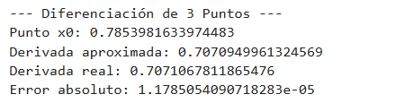
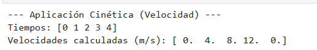
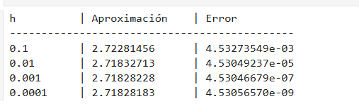

# Tema 4: Diferenciación e Integración Numérica

Este módulo aborda técnicas para estimar cambios instantáneos (derivadas) y acumulaciones (integrales) cuando las funciones son complejas, costosas de evaluar analíticamente o solo se conocen valores en puntos discretos (tablas de datos).

En el siguiente video se explica a profundidad la teoría y la implementación de los métodos de Diferenciación e Integración Numérica, apoyado por herramientas de IA para facilitar la comprensión de los algoritmos.

*Haga clic en la imagen para ver el video en YouTube.*

## 1. Métodos de Diferenciación Numérica

La diferenciación numérica busca aproximar el valor de la derivada de una función en un punto específico $x_0$ utilizando valores conocidos de la función en su vecindad.

### 1.1 Regla de Diferencias de Tres Puntos
**Concepto:** Se basa en la expansión de la Serie de Taylor. La variante de "Diferencia Central" es la más utilizada porque el error de truncamiento es de segundo orden $O(h^2)$, lo que significa que si divides el paso $h$ a la mitad, el error se reduce a la cuarta parte.

**Algoritmo:**
1. Seleccionar el punto de interés $x_0$ y un tamaño de paso $h$ (valor pequeño como 0.01).
2. Evaluar la función en un paso adelante $f(x_0 + h)$ y un paso atrás $f(x_0 - h)$.
3. Restar ambos valores para cancelar los términos pares de la serie de Taylor.
4. Dividir el resultado entre $2h$.

**Fórmula:**
$$f'(x_0) \approx \frac{f(x_0+h) - f(x_0-h)}{2h}$$

**Ejercicios:**
* [4_Dif_3P_1.py](./4_Dif_3P_1.py): Validación con funciones trigonométricas.
* [4_Dif_3P_2.py](./4_Dif_3P_2.py): Estimación de velocidad instantánea a partir de datos de posición.
* [4_Dif_3P_3.py](./4_Dif_3P_3.py): Estudio de la convergencia variando el tamaño de paso $h$.

---

## 📊 Galería de Resultados Visuales: Diferenciación de Tres Puntos

En esta sección se presentan las capturas de pantalla de la ejecución de los algoritmos de diferenciación numérica. Se resalta el uso de la **Diferencia Central**, la cual proporciona una mayor precisión al cancelar los términos de error de primer orden.

| Ejercicio | Descripción | Captura del Resultado |
| :--- | :--- | :--- |
| **1. Validación Trigonométrica** | Cálculo de $f'(x)$ para funciones seno y coseno, comparando con el valor analítico. |  |
| **2. Velocidad Instantánea** | Aplicación práctica para determinar la velocidad a partir de datos discretos de posición. |  |
| **3. Estudio de Convergencia** | Análisis de cómo el error disminuye cuadráticamente al reducir el tamaño del paso $h$. |  |

> **Nota:** Para replicar estos resultados, ejecute los archivos `.py` correspondientes en su terminal local.

### 1.2 Regla de Diferencias de Cinco Puntos
**Concepto:** Al incluir más información (cinco puntos en lugar de tres), se logran cancelar más términos de error de la Serie de Taylor, alcanzando una precisión de cuarto orden $O(h^4)$. Es ideal para cálculos científicos de alta precisión.

**Algoritmo:**
1. Definir $x_0$ y el paso $h$.
2. Evaluar la función en cuatro puntos vecinos: $x_0 \pm h$ y $x_0 \pm 2h$.
3. Aplicar coeficientes específicos (ponderación) a cada evaluación para maximizar la cancelación de errores.
4. Dividir entre $12h$.

**Fórmula (Diferencia Central):**
$$f'(x_0) \approx \frac{-f(x_0+2h) + 8f(x_0+h) - 8f(x_0-h) + f(x_0-2h)}{12h}$$

**Ejercicios:**
* [4_Dif_5P_1.py](./4_Dif_5P_1.py): Derivación de funciones exponenciales y logarítmicas.
* [4_Dif_5P_2.py](./4_Dif_5P_2.py): Cálculo de la aceleración (segunda derivada) mediante diferencias finitas.
* [4_Dif_5P_3.py](./4_Dif_5P_3.py): Comparación de error relativo entre esquemas de 3 y 5 puntos.

---

## 2. Métodos de Integración Numérica

Buscan aproximar el valor de la integral definida $\int_{a}^{b} f(x) dx$, que representa el área neta bajo la curva.

### 2.1 Método del Trapecio (Compuesto)
**Concepto:** Aproxima la función mediante una línea recta en cada subintervalo, formando trapecios. La versión compuesta divide el intervalo $[a, b]$ en $n$ segmentos para mejorar la precisión.

**Algoritmo:**
1. Definir los límites $a, b$ y el número de subintervalos $n$.
2. Calcular el ancho de cada segmento: $h = (b-a)/n$.
3. Evaluar la función en los extremos y en los puntos intermedios $x_i = a + i \cdot h$.
4. Aplicar la suma: los valores intermedios se multiplican por 2 ya que son compartidos por dos trapecios contiguos.

**Fórmula:**
$$\int_{a}^{b} f(x) dx \approx \frac{h}{2} \left[ f(a) + 2 \sum_{i=1}^{n-1} f(x_i) + f(b) \right]$$

**Ejercicios:**
* [4_Int_Tr_1.py](./4_Int_Tr_1.py): Aproximación del área de una función cuadrática.
* [4_Int_Tr_2.py](./4_Int_Tr_2.py): Cálculo de energía acumulada a partir de potencia variable.
* [4_Int_Tr_3.py](./4_Int_Tr_3.py): Evaluación del error en función del número de trapecios $n$.

### 2.2 Regla de Simpson (1/3)
**Concepto:** En lugar de rectas, utiliza polinomios de segundo grado (parábolas) para ajustar los puntos. Es mucho más exacto que el Trapecio para funciones con curvatura.

**Algoritmo:**
1. Dividir el intervalo en $n$ subintervalos (donde $n$ **debe ser par**).
2. Calcular $h = (b-a)/n$.
3. Evaluar la función en los nodos.
4. Sumar los valores aplicando pesos: extremos por 1, nodos impares por 4 y nodos pares por 2.

**Fórmula:**
$$\int_{a}^{b} f(x) dx \approx \frac{h}{3} \left[ f(x_0) + 4 \sum_{j=1,3,5}^{n-1} f(x_j) + 2 \sum_{j=2,4,6}^{n-2} f(x_j) + f(x_n) \right]$$

**Ejercicios:**
* [4_Int_Simp_1.py](./4_Int_Simp_1.py): Implementación de la regla de Simpson 1/3 para funciones polinómicas.
* [4_Int_Simp_2.py](./4_Int_Simp_2.py): Cálculo de deflexión en vigas mediante integración.
* [4_Int_Simp_3.py](./4_Int_Simp_3.py): Comparación de eficiencia entre Trapecio y Simpson.

### 2.3 Método de la Cuadratura Gaussiana
**Concepto:** Es el método más eficiente. No usa puntos equiespaciados, sino que selecciona puntos óptimos ($t_i$) y pesos ($w_i$) derivados de los polinomios de Legendre, permitiendo integrar polinomios de grado $2n-1$ de forma exacta.

**Algoritmo:**
1. Realizar un cambio de variable para transformar el intervalo $[a, b]$ al intervalo estándar $[-1, 1]$.
2. Seleccionar el número de puntos de Gauss (n=2, 3...).
3. Consultar los pesos $w$ y puntos $t$ tabulados.
4. Evaluar la suma ponderada de la función transformada.

**Fórmula:**
$$\int_{a}^{b} f(x) dx \approx \frac{b-a}{2} \sum_{i=1}^{n} w_i f\left( \frac{b-a}{2} t_i + \frac{b+a}{2} \right)$$

**Ejercicios:**
* [4_Int_Gauss_1.py](./4_Int_Gauss_1.py): Implementación de Cuadratura Gaussiana de 2 puntos.
* [4_Int_Gauss_2.py](./4_Int_Gauss_2.py): Integración de funciones trascendentales (e^x, log).
* [4_Int_Gauss_3.py](./4_Int_Gauss_3.py): Aplicación en el cálculo del centro de masa de una placa.
