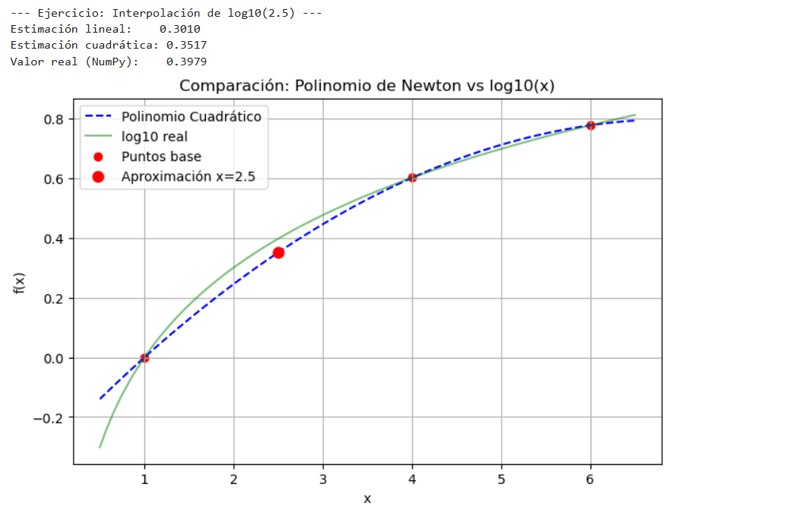
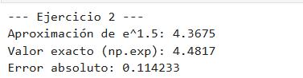
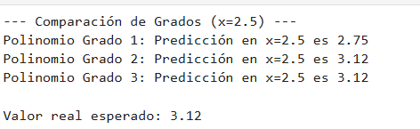
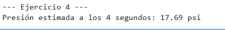
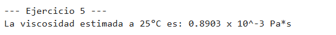
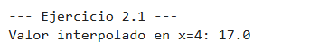
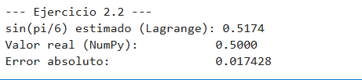
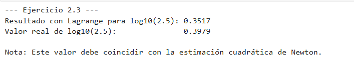
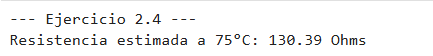
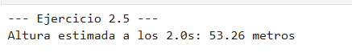

# Tema 5: Interpolación

En este tema se estudian las técnicas para determinar valores intermedios entre puntos de datos conocidos. La interpolación permite construir una función que pase exactamente por todos los puntos dados, siendo los métodos de Newton y Lagrange los más fundamentales para aproximar funciones complejas a partir de datos discretos.

---

## 1. Método de Interpolación de Newton

### Concepto
Este método se basa en el uso de **Diferencias Divididas**. Su principal ventaja es que es computacionalmente eficiente cuando se requiere aumentar el grado del polinomio de forma iterativa, ya que los coeficientes calculados previamente se mantienen constantes al añadir nuevos puntos de datos.

### Algoritmo
1. **Fase de Diferencias Divididas**: Se construye una tabla piramidal donde cada término se calcula como:
   $$f[x_i, x_{i-1}, \dots, x_0] = \frac{f[x_i, \dots, x_1] - f[x_{i-1}, \dots, x_0]}{x_i - x_0}$$
2. **Sustitución en el Polinomio**: Se utilizan los coeficientes del borde superior de la tabla para formar el polinomio:
   $$P_n(x) = f(x_0) + \sum_{i=1}^{n} f[x_i, \dots, x_0] \prod_{j=0}^{i-1} (x - x_j)$$

### Implementación
* [Código Base: Diferencias Divididas de Newton](./Newton_Master.py)

### Ejercicios
* [Ejercicio 1: Interpolación Lineal y Cuadrática (Newton)](./ejercicio1.py)
* [Ejercicio 2: Aproximación de funciones logarítmicas](./ejercicio2.py)
* [Ejercicio 3: Análisis de error según el grado del polinomio](./ejercicio3.py)
* [Ejercicio 4: Interpolación con 5 puntos de datos complejos](./ejercicio4.py)
* [Ejercicio 5: Aplicación práctica: Datos de termodinámica](./ejercicio5.py)

---

## 📊 Galería de Resultados Visuales: Método de Interpolación de Newton

En esta sección se presentan las capturas de pantalla de la ejecución del algoritmo de Newton basado en **Diferencias Divididas**. Este método es altamente eficiente para construir polinomios de forma iterativa, permitiendo añadir nuevos puntos de datos sin necesidad de recalcular todos los coeficientes desde cero.

| Ejercicio | Descripción | Captura del Resultado |
| :--- | :--- | :--- |
| **1. Interpolación Lineal y Cuadrática** | Construcción de polinomios de bajo grado para aproximaciones rápidas. |  |
| **2. Funciones Logarítmicas** | Aproximación de funciones no lineales mediante el esquema de Newton. |  |
| **3. Análisis de Grado** | Observación de cómo varía la precisión al incrementar el grado del polinomio. |  |
| **4. Puntos Complejos** | Interpolación utilizando un conjunto de 5 puntos de datos con comportamiento irregular. |  |
| **5. Datos de Termodinámica** | Aplicación práctica: Ajuste de datos experimentales de tablas térmicas. |  |

> **Nota:** Para replicar estos resultados, ejecute los archivos `.py` correspondientes en su terminal local.

## 2. Método de Interpolación de Lagrange

### Concepto
A diferencia de Newton, el método de Lagrange evita el cálculo de diferencias divididas mediante el uso de **Polinomios de Base**. Es una formulación matemáticamente elegante que expresa el polinomio como una combinación lineal de los valores de la función en los puntos dados.

### Algoritmo
1. **Cálculo de Polinomios Base ($L_i$)**: Para cada punto $i$, se define una función que se anula en todos los demás puntos:
   $$L_i(x) = \prod_{j=0, j \neq i}^{n} \frac{x - x_j}{x_i - x_j}$$
2. **Suma Ponderada**: El polinomio interpolante final se obtiene sumando los productos de los valores $y_i$ por sus respectivos $L_i(x)$:
   $$P_n(x) = \sum_{i=0}^{n} f(x_i) L_i(x)$$

### Implementación
* [Código Base: Polinomios de Lagrange](./Lagrange_Master.py)

### Ejercicios
* [Ejercicio 1: Interpolación de Lagrange de Segundo Grado](./ejercicio1L.py)
* [Ejercicio 2: Comparación de precisión con el método de Newton](./ejercicio2L.py)
* [Ejercicio 3: Interpolación de funciones trigonométricas](./ejercicio3L.py)
* [Ejercicio 4: Aplicación en trayectoria de proyectiles](./ejercicio4L.py)
* [Ejercicio 5: Análisis de oscilación y Fenómeno de Runge](./ejercicio5L.py)

---

## 📊 Galería de Resultados Visuales: Método de Interpolación de Lagrange

En esta sección se presentan las capturas de pantalla de la ejecución del algoritmo de Lagrange. Se destaca su capacidad para expresar el polinomio interpolante como una combinación lineal de valores de la función, siendo una alternativa directa al esquema de Newton para conjuntos de datos fijos.

| Ejercicio | Descripción | Captura del Resultado |
| :--- | :--- | :--- |
| **1. Interpolación de Segundo Grado** | Construcción de un polinomio cuadrático que pasa exactamente por tres puntos dados. |  |
| **2. Newton vs. Lagrange** | Comparativa de resultados para demostrar que ambos métodos convergen al mismo polinomio. |  |
| **3. Funciones Trigonométricas** | Uso de polinomios de Lagrange para aproximar curvas de funciones seno y coseno. |  |
| **4. Trayectoria de Proyectiles** | Aplicación física: Reconstrucción de la trayectoria parabólica a partir de datos de radar. |  |
| **5. Fenómeno de Runge** | Análisis de la oscilación en los bordes al usar interpolación de alto grado en puntos equiespaciados. |  |

> **Nota:** Para replicar estos resultados, ejecute los archivos `.py` correspondientes en su terminal local.
---
"La interpolación es el arte de leer entre líneas los datos para descubrir la función oculta."
