# Tema 6: Solución de Ecuaciones Diferenciales

En este tema se estudian los métodos numéricos para aproximar soluciones de ecuaciones diferenciales ordinarias (EDO) de la forma $dy/dx = f(x, y)$. Estas técnicas son fundamentales en ingeniería para modelar sistemas dinámicos.

---

## 1. Métodos de un Paso (Euler y Runge-Kutta)

### Concepto
Estos métodos utilizan la información de un solo punto previo $(x_i, y_i)$ para estimar el valor del siguiente punto. El método de Runge-Kutta de 4to orden (RK4) es el estándar por su precisión de cuarto orden.

### Algoritmo
1. **Cálculo de pendientes**: Se determinan cuatro pendientes intermedias ($k_1, k_2, k_3, k_4$).
2. **Sustitución**: Se promedian las pendientes para dar el paso final:
   $$y_{i+1} = y_i + \frac{h}{6}(k_1 + 2k_2 + 2k_3 + k_4)$$

### Implementación
* [Código Base: Runge-Kutta 4to Orden](./RK4_Master.py)

### Ejercicios
* [Ejercicio 1.1: Comparativa de error Euler vs RK4](./ejercicio_6_1_1.py)
* [Ejercicio 1.2: Ley de enfriamiento de Newton](./ejercicio_6_1_2.py)
* [Ejercicio 1.3: Vaciado de un tanque cilíndrico](./ejercicio_6_1_3.py)
* [Ejercicio 1.4: Circuito RC con fuente constante](./ejercicio_6_1_4.py)
* [Ejercicio 1.5: Caída libre con resistencia del aire](./ejercicio_6_1_5.py)

---

## 📊 Galería de Resultados Visuales: Métodos de un Paso (Euler y RK4)

En esta sección se presentan las capturas de pantalla de la resolución de Ecuaciones Diferenciales Ordinarias (EDO). Se destaca la comparación entre el método de Euler (primer orden) y el de Runge-Kutta de 4to orden (RK4), evidenciando la alta precisión de este último para modelar fenómenos físicos complejos.

| Ejercicio | Descripción | Captura del Resultado |
| :--- | :--- | :--- |
| **1.1 Euler vs. RK4** | Comparativa directa de precisión y acumulación de error entre ambos métodos. | 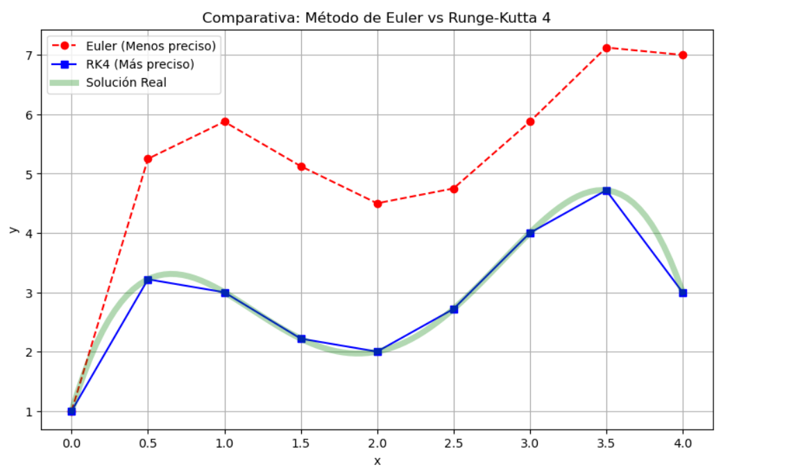 |
| **1.2 Ley de Enfriamiento** | Modelado de la variación de temperatura de un objeto en el tiempo. | 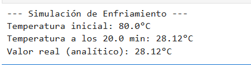 |
| **1.3 Vaciado de Tanque** | Simulación del nivel de líquido en un tanque cilíndrico con orificio de salida. | 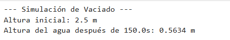 |
| **1.4 Circuito RC** | Análisis de la carga de un capacitor con una fuente de voltaje constante. | 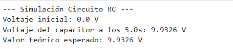 |
| **1.5 Caída Libre** | Simulación de la velocidad y posición considerando la resistencia del aire. | 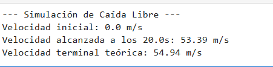 |

> **Nota:** Para replicar estos resultados, ejecute los archivos `.py` correspondientes en su terminal local.

## 2. Métodos de Pasos Múltiples

### Concepto
Aprovechan la información de varios puntos anteriores para predecir el siguiente valor, usualmente mediante esquemas de **Predictor-Corrector**.

### Algoritmo
1. **Predicción**: Se usa una fórmula explícita (Adams-Bashforth) para predecir $y_{i+1}$.
2. **Corrección**: Se usa una fórmula implícita (Adams-Moulton) para refinar el valor.

### Implementación
* [Código Base: Adams-Bashforth-Moulton](./Predictor_Corrector_Master.py)

### Ejercicios
* [Ejercicio 2.1: Implementación de 4 pasos](./ejercicio_6_2_1.py)
* [Ejercicio 2.2: Análisis de estabilidad](./ejercicio_6_2_2.py)
* [Ejercicio 2.3: Comparación con métodos de un paso](./ejercicio_6_2_3.py)
* [Ejercicio 2.4: Error de truncamiento local](./ejercicio_6_2_4.py)
* [Ejercicio 2.5: Aplicación en cinética química](./ejercicio_6_2_5.py)

---

## 📊 Galería de Resultados Visuales: Métodos de Pasos Múltiples

En esta sección se presentan las capturas de pantalla de los esquemas **Predictor-Corrector**. Estos métodos aprovechan la información de múltiples puntos previos para refinar la aproximación, siendo ideales para sistemas donde la estabilidad a largo plazo es crítica.

| Ejercicio | Descripción | Captura del Resultado |
| :--- | :--- | :--- |
| **2.1 Implementación de 4 pasos** | Uso del esquema Adams-Bashforth de cuarto orden para resolver EDOs. | 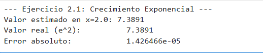 |
| **2.2 Análisis de Estabilidad** | Pruebas de convergencia del método frente a diferentes tamaños de paso. | 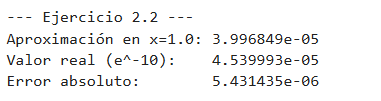 |
| **2.3 Pasos Múltiples vs. Un Paso** | Comparativa detallada: Adams-Moulton vs. Runge-Kutta 4. | 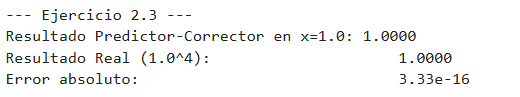 |
| **2.4 Error de Truncamiento** | Visualización del error local acumulado durante la simulación. | 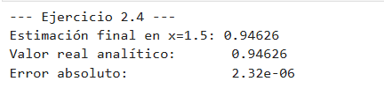 |
| **2.5 Cinética Química** | Aplicación: Simulación de la variación de concentración en una reacción. | 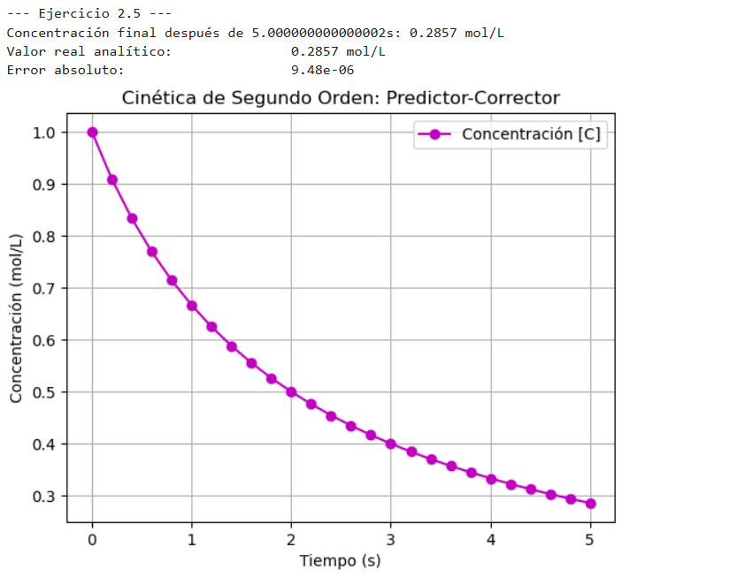 |

> **Nota:** Para replicar estos resultados, ejecute los archivos `.py` correspondientes en su terminal local.

## 3. Sistemas de Ecuaciones Diferenciales Ordinarias

### Concepto
Se resuelve un conjunto de EDOs simultáneas de primer orden aplicando métodos como RK4 de forma vectorial.

### Algoritmo
1. **Definición Vectorial**: Se define un vector de estado $\mathbf{y} = [y_1, y_2, \dots, y_n]^T$.
2. **Cálculo Vectorial**: Se obtienen los vectores $\mathbf{k}_n$ evaluando el sistema completo.

### Implementación
* [Código Base: Sistemas de EDOs con RK4](./Sistemas_EDO_Master.py)

### Ejercicios
* [Ejercicio 3.1: Modelo Depredador-Presa](./ejercicio_6_3_1.py)
* [Ejercicio 3.2: Sistema Masa-Resorte Amortiguado](./ejercicio_6_3_2.py)
* [Ejercicio 3.3: Péndulo simple no lineal](./ejercicio_6_3_3.py)
* [Ejercicio 3.4: Reacciones químicas acopladas](./ejercicio_6_3_4.py)
* [Ejercicio 3.5: Circuito RLC de segundo orden](./ejercicio_6_3_5.py)

---

## 📊 Galería de Resultados Visuales: Sistemas de EDOs con RK4

En esta sección se presentan las capturas de pantalla de la resolución de sistemas de ecuaciones simultáneas. Se utiliza la implementación vectorial de RK4 para modelar la evolución temporal de múltiples variables interdependientes, garantizando una precisión de cuarto orden en todo el sistema.

| Ejercicio | Descripción | Captura del Resultado |
| :--- | :--- | :--- |
| **3.1 Modelo Depredador-Presa** | Simulación de las poblaciones de dos especies (Lotka-Volterra) y sus ciclos de interacción. | 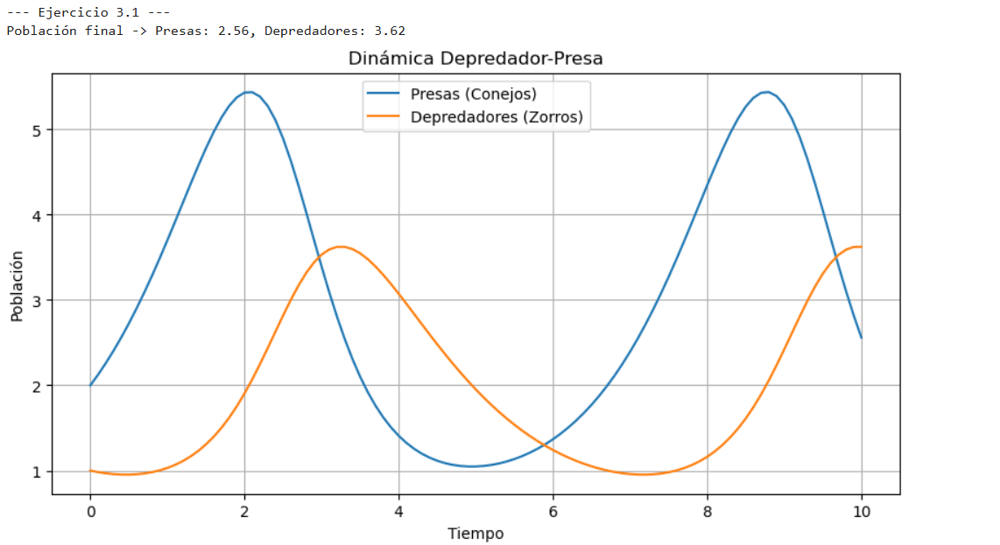 |
| **3.2 Masa-Resorte Amortiguado** | Modelado físico de un sistema mecánico considerando masa, elasticidad y amortiguamiento. | 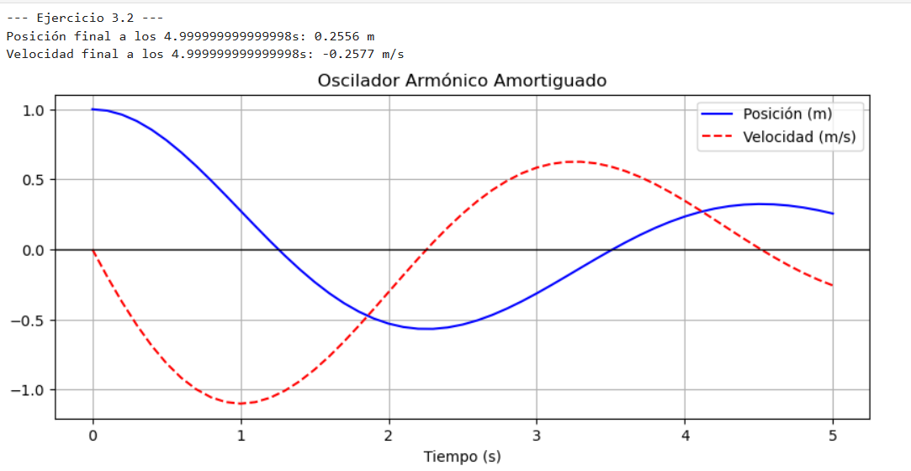 |
| **3.3 Péndulo Simple No Lineal** | Resolución de la ecuación del péndulo sin la aproximación de ángulos pequeños. | 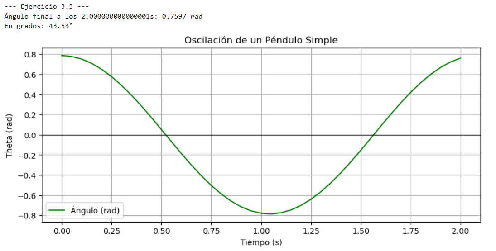 |
| **3.4 Reacciones Químicas Acopladas** | Evolución de las concentraciones en un sistema de reacciones en cadena. | 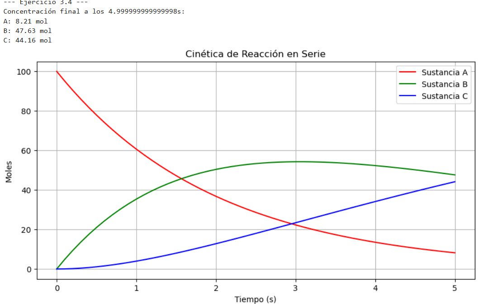 |
| **3.5 Circuito RLC de Segundo Orden** | Análisis de la respuesta transitoria en un circuito con resistencia, inductor y capacitor. | 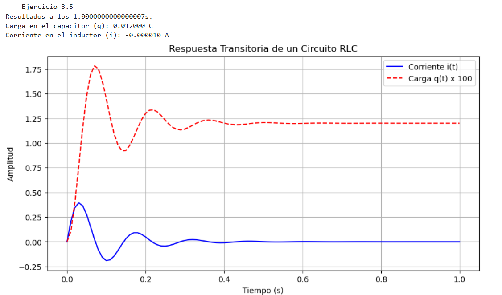 |

> **Nota:** Para replicar estos resultados, ejecute los archivos `.py` correspondientes en su terminal local.